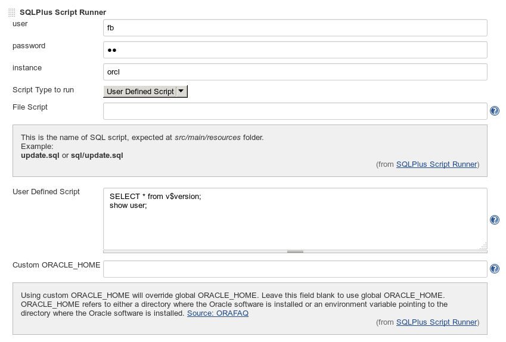
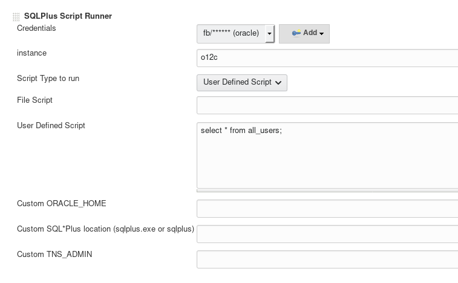
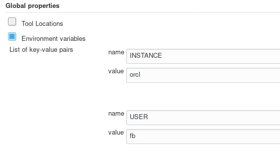

# Summary

This plugin enables you run [Oracle SQL\*Plus](http://www.orafaq.com/wiki/SQL*Plus_FAQ) scripts on your Jenkins jobs (user defined scripts or a script inside a workspace).
 
*Oracle SQL\*Plus installation required!* 

# Releases

-   **1.x** - For Jenkins 1.x

-   **2.x** - For mainly Jenkins 2.x, credentials plugins implemented  and pipeline support

# Quickstart 

All you have to do is provide a valid *ORACLE_HOME* and you are in business:

You can run a script inside your workspace or a user defined for every job:

You can check later all SQL*Plus output inside your build output:

Download the last release and give it a try!

# Using Pipeline

## user defined script
 
node {
   echo 'SQLPlusRunner running user define script for system@xe'
   step([$class: 'SQLPlusRunnerBuilder',credentialsId:'system', instance:'xe',scriptType:'userDefined', script: '',scriptContent: 'select * from v$version'])
}

## file script

node {
   echo 'SQLPlusRunner running file script for system@xe'
   step([$class: 'SQLPlusRunnerBuilder',credentialsId:'system', instance:'xe',scriptType:'file', script: 'start.sql',scriptContent: ''])
}

### Optional parameters

* customOracleHome
* customSQLPlusHome
* customTNSAdmin
* customNLSLang
* customSQLPath
* isSysDba
* isHideSQLPlusVersion

# Developer guide

1. Fork repository
2. Code code code
3. Run it with:

* mvn clean
* mvn  -DskipTests package
* mvn generate-sources  (convert Message*.properties into Messages.java)
* mvn compiler:compile
* mvn  -DskipTests package hpi:run

4. Try it at http://localhost:8080
5. Commit and submit pull request

# Translator guide

1. Fork repository
2. Copy config.properties to config_<lang>.properties (example: config_pt_BR.properties)
3. Copy global.properties to global_<lang>.properties
4. Copy Messages.properties to Messages_<lang>.properties
5. Copy all HTML files too
6. Translate it
7. Run it with:

* mvn clean -DskipTests package hpi:run

8. Try it at http://localhost:8080
9. Commit and submit pull request

# Having problems?

Please [open a new issue](https://github.com/jenkinsci/sqlplus-script-runner-plugin/issues/new)  and inform:

- Jenkins server Operation System;
- Jenkins version;
- Where SQLPlus Script Runner is running (local machine or agent machine);
- Agent machine Operation System (if applicable);
- Oracle Database version;
- Oracle SQL*Plus version;
- Build log with debug info enabled.

 
## Migration Guide from 1.x

To migrate your workspace from version 2 is very simple, all you need todo is:

1.  Create a credential for your user and password;
2.  Edit you job configuration and select one credential;
3.  Save your changes and you are good to go!

# Configuration

## Global

All you have to do is check the auto detect ORACLE\_HOME option ( or a valid *ORACLE\_HOME* ) and you are in business:

If you are having problems try to enable *Debug info* to see what is going on.

## By Job

You can run a script inside your workspace or a user defined for every job:

Version 1.x:
 

Version 2.x :

# Environment variables
 
Pay attention to what version you are using in order to work with variables:

| variable | Version 1.x |        Version 2.x        |
|----------|:-----------:|:-------------------------:|
| user     |       ok    | *replaced by credentials* |
| password |      ok     | *replaced by credentials* |
| instance |      ok     |             ok            |
 

You can use global variables for **user** and **instance**, first creating it in *Jenkins*→ *configuration* :

 

You *user* global variable can hold **username and password** as well like this (*username/password*):

  

And then using it:

# Running

You can check later all SQL\*Plus output inside your build output:

 
# Reported problems

## my script takes forever to execute...

*Windows* users sometimes get a running script stuck on build, even though they run everything on Oracle.

In that case you should use [Build](https://wiki.jenkins.io/display/JENKINS/Build-timeout+Plugin)[Time Outplugin](https://wiki.jenkins.io/display/JENKINS/Build-timeout+Plugin) together to get everything working fine.

## I have an error ORA-????

You should try running manually SQL\*Plus before use Jenkins.

Sometimes on *Linux* Jenkins has his **own** Operation System user with his own variables.

## Every time I get this error: *cannot find sqlplus *

Jenkins plugin can't find SQL\*Plus executable file.

You should do in this order:

1.  Stop Jenkins;
2.  Find where are *sqlplus executable* file (usually at    **$ORACLE\_HOME**);
3.  Check if they have proper permissions (*chmod 755 \**);
4.  Create a global environment variable **ORACLE\_HOME** like this: 
    **export
    ORACLE\_HOME=/oracle/app/oracle/product/12.1.0/dbhome\_1/   ** or  
    **export ORACLE\_HOME=\<your-sqlplus-directory\>**

5.  Test your environment with:  *sqlplus -v   * , should return    **SQL\*Plus version like SQL\*Plus: Release 12.1.0.1.0 Production**
6.  Start Jenkins;
7.  Use the try to detect **ORACLE\_HOME** option;
8.  Retry your SQL\*Plus operation.

## Every time I get this error: *libsqlplus.so: cannot open shared object file: No such file or directory* or *SP2-0667: Message file sp1.msb* not found

SQL\*Plus need its library and its message file to work properly.

You should do in this order:

1.  Stop Jenkins;
2.  Find where are *libsqlplus.so* files (usually at   **$ORACLE\_HOME\\lib** );
3.  Check if they have proper permissions (*chmod 755 \**);
4.  Create a global environment variable **LD\_LIBRARY\_PATH** like    this:  
    **export LD\_LIBRARY\_PATH=$ORACLE\_HOME/lib:$LD\_LIBRARY\_PATH **  
    or   **export
    LD\_LIBRARY\_PATH=\<your-libsqlplus-directory\>:$LD\_LIBRARY\_PATH**

5.  Test your environment with:  *sqlplus -v   * , should return
    **SQL\*Plus version like SQL\*Plus: Release 12.1.0.1.0 Production**

6.  Start Jenkins;

7.  Use the try to detect **ORACLE\_HOME** option;

8.  Retry your SQL\*Plus operation.

## I want to hide my user / password from Console Output

1.  Install [Mask Passwords  Plugin](https://wiki.jenkins.io/display/JENKINS/Mask%2BPasswords%2BPlugin);

2.  Setup to hide everything you want.

# I have a bug to report

Please [open a newissue](https://github.com/jenkinsci/sqlplus-script-runner-plugin/issues/new) and inform:

-   Jenkins server Operation System;
-   Jenkins version ;
-   Where SQLPlus Script Runner is running (*local* machine or *slave*
    machine);
-   Slave machine Operation System (if applicable);
-   Oracle Database version;
-   Oracle SQL\*Plus version;
-   Build log with debug info enabled.

